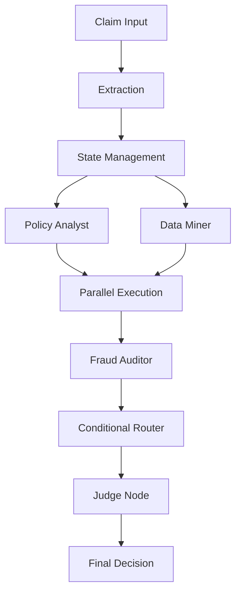
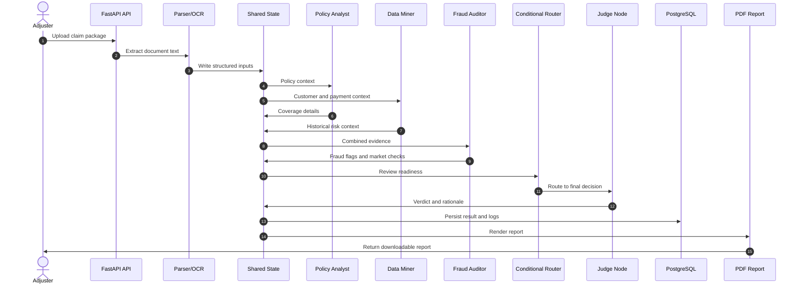
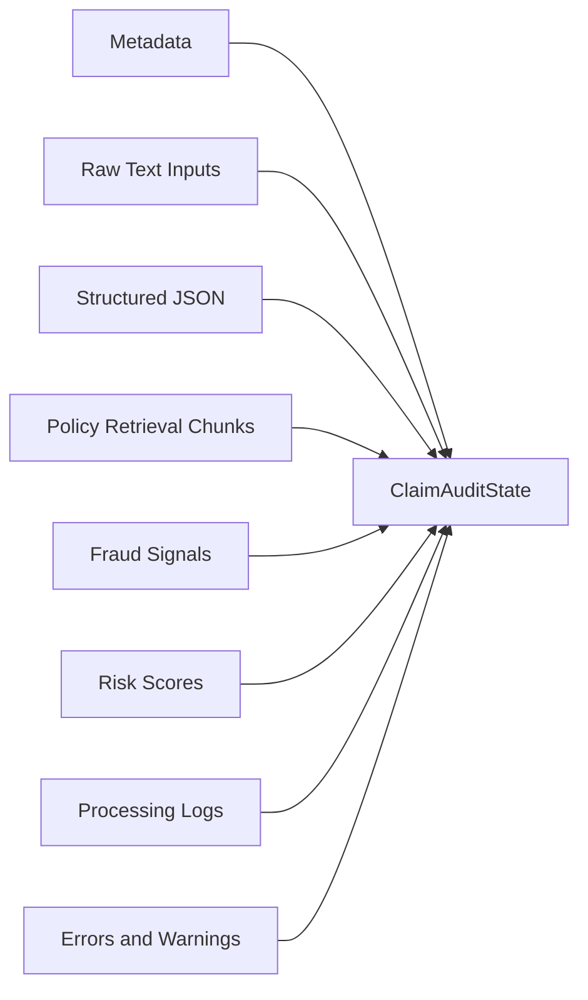
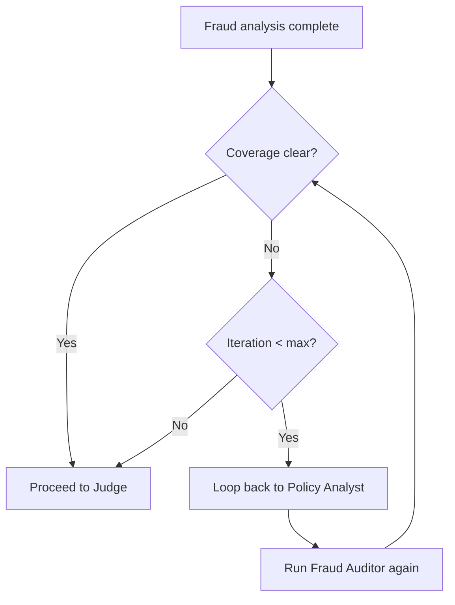
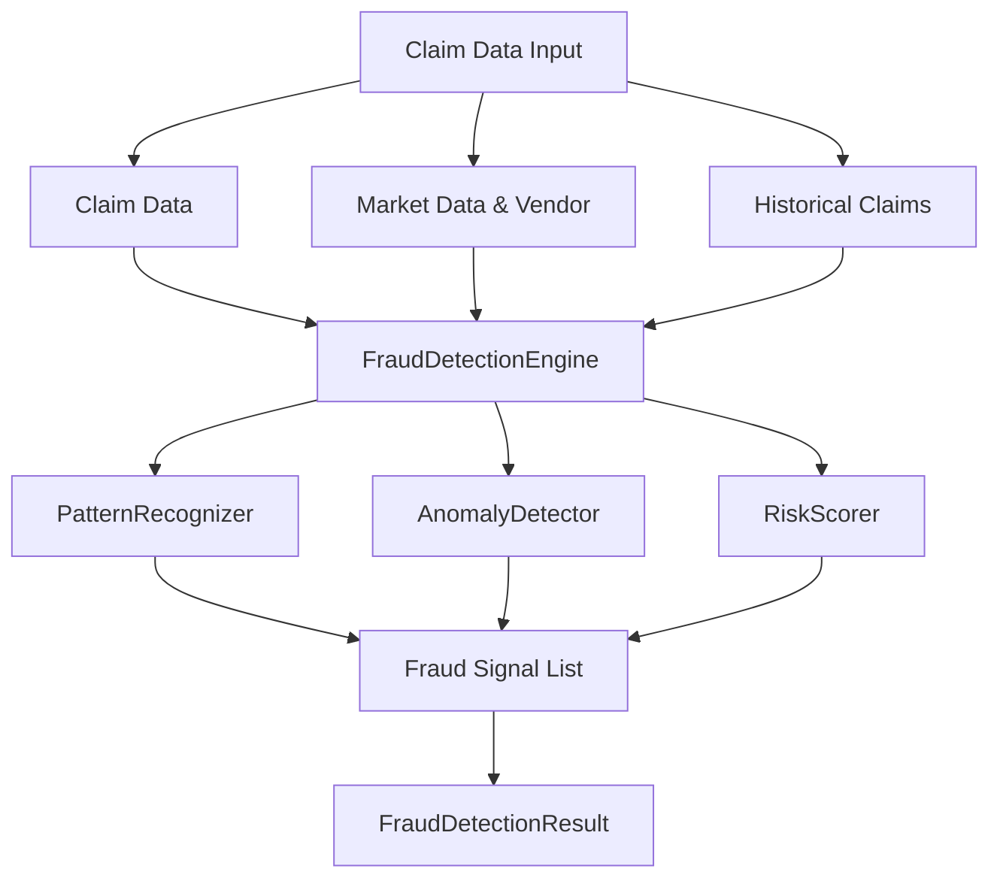
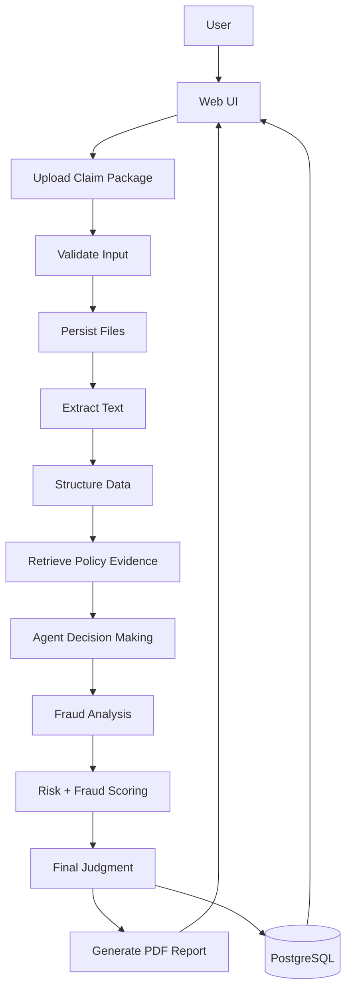

# ClaimSense Multi-Agent Architecture

This document is the technical deep dive for the ClaimSense multi-agent claim auditing system.

It explains how the claim pipeline is split into extraction, shared state management, parallel agent execution, fraud analysis, conditional routing, and final judgment.

## 1. Architecture Overview

ClaimSense processes a claim as a structured review workflow rather than a single monolithic AI call. The design keeps every step auditable and makes each agent responsible for a narrow task.

## 2. System Goals

- Keep the claim review path explainable.
- Separate deterministic extraction from probabilistic reasoning.
- Compare the claim against policy text, historical behavior, and market signals.
- Allow the system to loop back when coverage is unclear.
- Produce a final output that can be reviewed by a human adjuster.

## 3. Core Pipeline Stages

### 3.1 Extraction

The first stage normalizes raw claim artifacts into structured inputs.

- Claim documents are converted to text.
- Invoice and policy text are extracted.
- Optional evidence documents are appended as supporting context.
- Optional historical claim data is loaded as structured context.

Relevant code paths:

- [app/services/document_parser.py](app/services/document_parser.py)
- [app/services/extraction.py](app/services/extraction.py)
- [app/api/claims.py](app/api/claims.py)

### 3.2 State Management

All agent outputs flow through a shared state object so the review remains traceable.

The state typically carries:

- metadata such as claim ID, user ID, policy ID, and tenant context
- raw text from claim, invoice, policy, and evidence files
- structured JSON extracted from each source
- retrieved policy excerpts and RAG chunks
- fraud flags, risk scores, and justification data
- processing logs, warnings, and errors

Relevant code paths:

- [app/agents/state.py](app/agents/state.py)
- [app/agents/orchestrator.py](app/agents/orchestrator.py)

### 3.3 Parallel Agent Execution

Two agents run in parallel after extraction and state initialization:

- Policy Analyst: extracts coverage, exclusions, and deductibles.
- Data Miner: checks customer history, payment status, and prior claim patterns.

The parallel design reduces serial dependency and lets the fraud stage see both policy and behavioral context.

### 3.4 Fraud Analysis

The Fraud Auditor consumes the outputs from the parallel agents and adds external signals such as market pricing and anomaly detection.

- Web search helps validate vendor legitimacy and market value.
- Anomaly detection flags unusual feature combinations.
- Rule-based checks catch obvious discrepancies.

### 3.5 Conditional Routing

After fraud analysis, the router decides whether the system can move directly to judgment or should loop back for more analysis.

- If coverage is clear and evidence is sufficient, proceed to Judge.
- If material uncertainty remains, loop back to policy analysis.
- If the iteration cap is reached, force judgment with the best available evidence.

### 3.6 Final Judgment

The Judge synthesizes all evidence and returns the final decision-support output.

- verdict: APPROVED, DENIED, or REVIEW
- payout amount
- risk score
- fraud probability
- rationale

## 4. Detailed Flow

## 5. Agent Roles & Responsibilities

### 🎓 Policy Analyst (The Scholar)

- Job: extract policy coverage details.
- Tools: RAG search on policy documents.
- Output: coverage limits, exclusions, deductibles.
- Example: This policy covers theft up to $10,000 with a $500 deductible.

### 🔍 Data Miner (The Investigator)

- Job: analyze customer history and payment behavior.
- Tools: database queries for claims history and payment status.
- Output: customer profile, frequency analysis, and red flags.
- Example: customer has filed no claims in the past 12 months and all payments are current.

### 😼 Fraud Auditor (The Cynic)

- Job: identify suspicious patterns and anomalies.
- Tools: market price search, vendor verification, anomaly checks.
- Output: suspicious flags, market analysis, risk assessment.
- Example: claimed value is significantly above market value.

### ⚖️ Judge (The Final Arbitrator)

- Job: synthesize evidence and issue the final verdict.
- Tools: LLM with structured output.
- Output: APPROVED, DENIED, or REVIEW with payout amount and risk score.
- Example: approved at fair market value after deductible.

## 6. Shared State Model

The shared state is the backbone of the architecture. It prevents each agent from starting from scratch and keeps the system auditable.

### Typical state categories

| Category | Example fields | Purpose |
|---|---|---|
| Metadata | claim_id, user_id, policy_id, tenant_id | Identifies the case being processed |
| Raw inputs | raw_claim_text, raw_invoice_text, raw_policy_text | Preserves original evidence |
| Structured data | structured_claim, structured_invoice, structured_policy | Normalized machine-readable context |
| Retrieval context | rag_chunks, extracted_clauses | Policy evidence for reasoning |
| Fraud context | suspicious_flags, fraud_probability, market_price_analysis | Fraud detection and scoring |
| Final output | final_verdict, payout_amount, risk_score, rationale | Decision-support result |

## 7. Conditional Routing Logic

The conditional router prevents premature decisions when the evidence is weak.

### Routing conditions

- Loop back when policy language needs deeper interpretation.
- Loop back when fraud signals are high but not yet conclusive.
- Stop looping when the configured maximum iteration count is reached.
- Route to Judge when enough evidence has been collected.

## 8. Fraud Detection Sub-Architecture

ClaimSense includes a dedicated fraud detection layer that supplements the agent workflow.

### Fraud detection components

| Component | Role | Output |
|---|---|---|
| FraudDetectionEngine | Coordinates the full fraud-analysis pipeline | Combined fraud decision output |
| PatternRecognizer | Detects rule-based fraud patterns | Linked claims, timing anomalies, vendor red flags |
| AnomalyDetector | Finds statistical outliers in claim features | Anomaly score and anomaly flag |
| RiskScorer | Combines signals into a final score | Risk score and fraud probability |
| Fraud Signal List | Stores all detected indicators | Typed fraud signals with severity and confidence |
| FraudDetectionResult | Final fraud analysis record | Verdict, risk score, fraud probability, signals |

### What this layer does

- Compares claim values against invoices, market data, and historical behavior.
- Flags suspicious timing, repeated claims, inflated estimates, and vendor issues.
- Converts raw evidence into a consistent fraud probability and risk score.
- Feeds the final scoring output into the judge and report generation path.

## 9. Data Flow to Final Report

## 10. Code Map

| File | Responsibility |
|---|---|
| [app/main.py](app/main.py) | FastAPI app setup, health route, SPA fallback, startup lifecycle |
| [app/api/claims.py](app/api/claims.py) | Upload, processing, status, and report endpoints |
| [app/api/router.py](app/api/router.py) | API router registration |
| [app/agents/state.py](app/agents/state.py) | Shared claim audit state |
| [app/agents/tools.py](app/agents/tools.py) | Agent tools for DB and search |
| [app/agents/nodes.py](app/agents/nodes.py) | Agent node implementations |
| [app/agents/orchestrator.py](app/agents/orchestrator.py) | Multi-agent workflow routing |
| [app/services/fraud_detection_v2.py](app/services/fraud_detection_v2.py) | Fraud detection engine and signal aggregation |
| [app/services/risk_scoring.py](app/services/risk_scoring.py) | Risk and fraud score computation |
| [app/services/report_pdf.py](app/services/report_pdf.py) | PDF rendering |
| [app/services/web_search.py](app/services/web_search.py) | External vendor and market search |

## 11. Operational Notes

- The architecture is designed to work synchronously for local development and asynchronously with Celery in production.
- PostgreSQL stores case metadata, logs, and results.
- Uploaded files and generated reports are kept outside the code path for reproducibility.
- The final verdict is assistive, not authoritative; a human reviewer should approve the claim outcome.

## 12. Related Documents

- [README.md](README.md) for the project overview.
- [GETTING_STARTED.md](GETTING_STARTED.md) for setup and run instructions.
- [FRAUD_DETECTION_GUIDE.md](FRAUD_DETECTION_GUIDE.md) for a fraud-focused deep dive.
- [TESTING_GUIDE.md](TESTING_GUIDE.md) for test execution and coverage.
